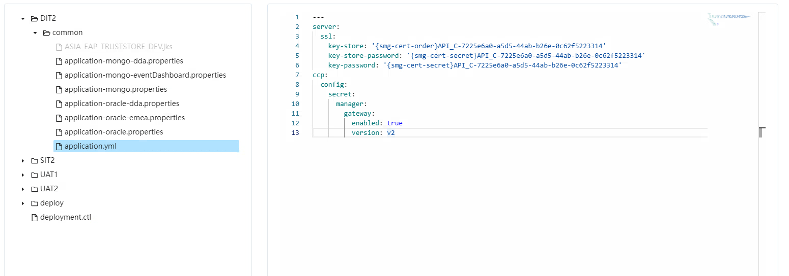

## 需求

页面分为左右两部分，左侧为文件夹树形菜单，右侧为选中配置文件的内容。

需要根据配置文件的格式对文本进行高亮（本文仅针对代码高亮部分进行记录）。

实现后效果：




## 分析

首先想的是通过 [highlight.js](https://highlightjs.org) 和 [Prism](https://prismjs.com) 这样的代码高亮 JS 库对文件内容进行高亮处理。但是由于 Prism 在公司的私有 Repository 中没有提供，只对 highlight.js 进行了测试。

测试 highlight.js 对代码进行高亮处理时发现问题，由于 API 返回的数据格式如下

``` javascript
"--- Inserver: \n ss1: \n   key-store:'(smg-cert-order}API_C-7225e6a0-a5d5-44ab-b26e-0c62f5223314'\n key-store-password:"(smg-cert-secret}API_C-7225e6a0-a5d5-44ab-b26e-0c625223314'\n"
```

经过处理后生成的 html 代码段只有颜色的变化而没有缩进换行。而后考虑使用代码块组件进行处理。

通过搜索和对 [NG-ZORRO 代码编辑器](https://ng.ant.design/experimental/code-editor/zh) 组件的研究找到两个比较流行的 Web 代码编辑器组件 [CodeMirror](https://codemirror.net/) 、 与VS Code 同源的 [Monaco Editor](https://microsoft.github.io/monaco-editor/) （NG-ZORRO 基于此库实现代码编辑器组件）。

但如果在 [Angular](https://angular.io/) 中想要使用上述库都需要对其进行一定的封装，所以继续搜索有无已经封装好可直接用于 [Angular](https://angular.io/) 中的组件。因为都是比较流行的框架所以很容易找到 [ngx-codemirror](https://github.com/scttcper/ngx-codemirror) 、[ngx-monaco-editor](https://github.com/atularen/ngx-monaco-editor#readme) 。因为公司的安全策略比较严格所以只能使用私有库中已有的组件，所以采用了 [ngx-monaco-editor](https://github.com/atularen/ngx-monaco-editor#readme) 解决该问题。（空余时间可以研究下两者区别）

至此这个需求已经基本解决，但又出现了一个新的问题。由于该组件支持的文件格式有限，需求中出现的 4 种文件格式中 3 种是不支持的，好在组件是支持自定义文件类型的。

总结一下现在需要做的工作有

1. 项目中引入 [ngx-monaco-editor](https://github.com/atularen/ngx-monaco-editor#readme) 
2. 注册自定义文件类型
3. 引用组件并将 API 返回内容传入


## 实践

### 项目中引入 [ngx-monaco-editor](https://github.com/atularen/ngx-monaco-editor#readme) 

参考官方 [Setup](https://github.com/atularen/ngx-monaco-editor#setup) 不做赘述

其中需要注意的是一定不要忘记在 Module 中引入 FormsModule

``` typescript
import { FormsModule } from '@angular/forms';
imports: [
    FormsModule,
    MonacoEditorModule.forRoot(monacoConfig)
]
```

因为组件中使用的数据双向绑定方法（ [(ngModel)]="code"）依赖于 FormsModule

``` html
<ngx-monaco-editor [options]="editorOptions" [(ngModel)]="code"></ngx-monaco-editor>
```


### 注册自定义文件类型

参考官方 [Configurations](https://github.com/atularen/ngx-monaco-editor#configurations) 

主要依赖于在 onMonacoLoad 方法中获取 monaco 实例，通过该实例对文件类型进行拓展。其中配置相关属性可参考 [Monaco Editor](https://microsoft.github.io/monaco-editor/) 中的Playground -> Example: Custom Languages。

主要任务是通过正则表达式对语句进行分词和检索，并给予相应的类型。其中支持的类型参考 [Monaco Editor](https://microsoft.github.io/monaco-editor/) 中的Playground -> Example:  Semantic Tokens Provider Example 和 [VS Code 源文件](https://github.com/microsoft/vscode/blob/main/src/vs/editor/standalone/common/themes.ts) 。分词策略中如果一段内容被匹配过两次，后面匹配到的内容将覆盖第一次匹配的结果，没有被第二次匹配到的部分维持第一次匹配到的类型。

``` typescript
const monacoConfig: NgxMonacoEditorConfig = {
	onMonacoLoad: () => {
    // register properties file type
    monaco.languages.register({ id: 'properties', aliases: ['properties'] });
    monaco.languages.setMonarchTokensProvider('properties', {
      ignoreCase: true,
      tokenizer: {
        root: [
          // '#' 开头的行类型将被定义为 notes 
          [/^\s*(\#).*/, 'notes'],	
          // 匹配一行等式 每个小括号代表一个类型
          [/(.*\s*)(\s*=\s*)(\w*[^\s]*)(\s*[\#]*\w*)/, ['key', 'sym', 'value', 'comment']]
        ]
      }
    });
    // register ctl file type
    monaco.languages.register({ id: 'ctl', aliases: ['ctl'] });
    monaco. languages.setMonarchTokensProvider('ctl', {
      ignoreCase: true,
      tokenizer: {
        root: [
          // 匹配 '|' 中间的内容为 key， '|' 为 delimiter
        	[/(\w*[^\|]*)(\|)/, ['key', 'delimiter']]
        ]
      }
    });
    // register configmap file type
    monaco.languages.register({ id: 'configmap', aliases: ['configmap', 'dit2', 'sit2', 'uatl', 'uat2', 'prod', 'prodi', 'prod2'] });
    monaco. languages. setMonarchTokensProvider('configmap', {
        ignoreCase: true,
        tokenizer: {
          root: [
            // 匹配一个 '--' 开头的等式
            [/(\s\-[\w*\-*]*)(\s*=\s*)(\w*[^\s]*)/,['keyword','sym','value']],
            // 陪陪一个 '-' 开头的配置名
            [/\s\-[\w*\*]*/, 'keyword']
           ]
        }
     });
   }
}
                                                                                             
```


### 引用组件并将 API 返回内容传入

参考官网 [Sample](https://github.com/atularen/ngx-monaco-editor#sample) 

Html

``` html
<ngx-monaco-editor [options]="editorOptions" [(ngModel)]="configContent"></ngx-monaco-editor>
```

Typescript

``` typescript
fileClick: Subject<string> = new Subject<string>();

constructor(
	private apiConfigurationService: ApiConfigurationService
) {
  // 点击文件时触发
	this.fileClick.asObservable().pipe(
    // 调用 API 取得数据
    // 此操作符如果在第一次没有完成时被触发第二次将会取消第一次的请求
    // 这样避免多次快速点击文件 最终文件内容错误问题
		switchMap(filePath => this.getContent(filePath))
  ).subscribe(res => {
    if (res.status === 2000) {
    	this.configContent = res.data;
    } else {
    }
  })
}

// 定义一个 Map 用于对文件别名的快速识别
export const FileTypeAliases: Map<string, string> = new Map([
  ['yaml', 'yam]'], 
  ['yml', 'yaml'l, 
  ['dit2', 'configmap'],
  ['sit2', 'configmap'], 
  ['uat1', 'configmap'],
  ['uat2', 'configmap'], 
  ['prod', 'configmap'],
  ['prod1', 'configmap'],
  ['prod2' ,'configmap']
 ])

// 点击文件时触发
getfileType(filePath: string) {
  const fileType = filePath?.slice(filePath?.lastIndex0f('.') + 1). toLowerCase();
  / search in aliases
  const typeFromAliases = FileTypeAliases.get(fileType);
  this.editorOptions = {
    theme: 'vs'
    language: typeFromAliases ? typeFromAliases: fileType, 
    roundedSelection: false, 	
    scrollBeyondLastLine: false, 
    readOnly: true, 
    contextmenu: false
  };
}

```


## 总结

自定义语言部分：

- 关于正则表达式进行分词的逻辑还不是完全清晰，需要进一步研究。

- 关于 aliases 定义过的别名，在传入组件中是不能背识别，需要进一步研究。

## 参考

自定义文件类型： [工作中的Monaco Editor使用经验总结](https://segmentfault.com/a/1190000042292716) 其中还有部分配置属性的功能讲解

正则表达式：[RUNOOB](https://www.runoob.com/regexp/regexp-syntax.html) 其中有一个动态正则匹配器可用于验证和调整正则表达式
